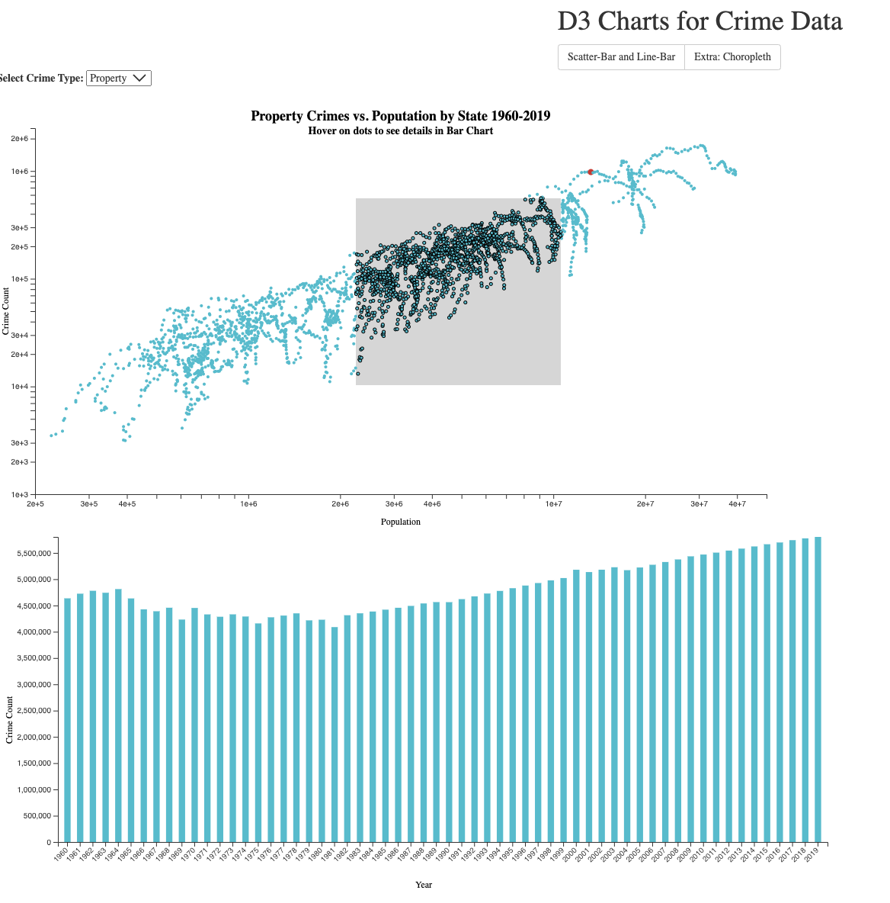

# Interacion

1. Hovering/clicking activities:
    Tooltips show details on demand (try to show more than the value)
    Highlight selected elements (i.e., bar, circle, line)
2. Connect: 
    Elements from different charts that are related should be highlighted together (e.g., if you have a scatterplot of Atlanta weather and a bar chart that shows the average temperature for each type of weather, when you hover over the sunny weather bar, you should highlight all the “sunny circles” in the scatterplot.)
    Brushing & Linking: choose one chart and add “brushing & linking”    interactivity. Use the brush to update the data or change the visual encoding for at least one other chart. 
3. Reconfigure:
    Add a dropdown menu for at least one of these three charts and use it to reconfigure the chart. For example, a menu might allow the user to change the attribute presented on an axis in a chart, which variable color is mapped to, etc.  

# Demo

https://cynthialmy.github.io/d3-Interaction/

